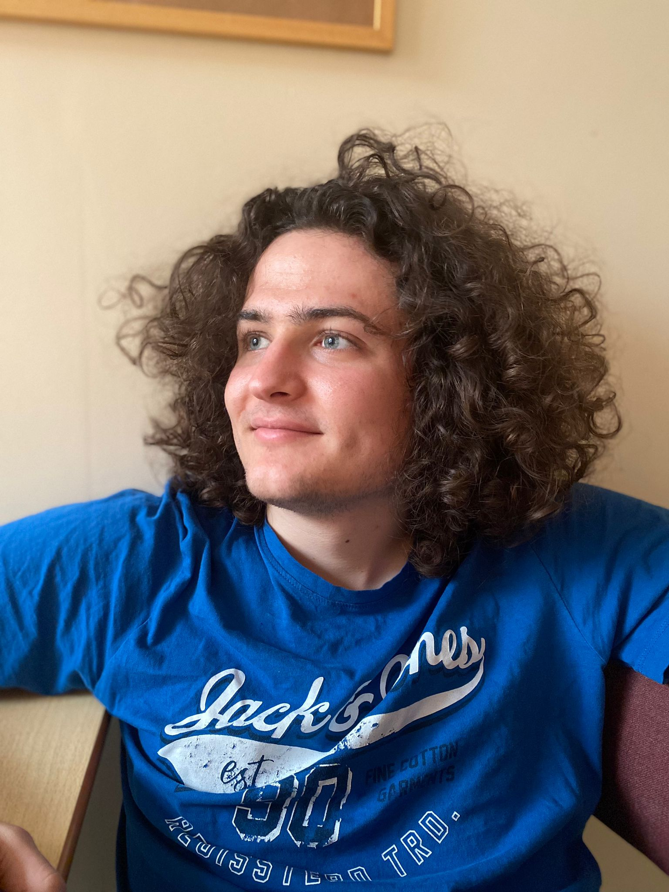

 

## About

I am a second year DPhil student at the University of Oxford in Mathematics, supervised by Lukas Brantner. 

I am mostly interested in homotopy theory and derived algebraic geometry, especially in mixed or positive characteristic.

## Research papers

**The period map from commutative to noncommutative deformations**. Available on arXiv [here](https://arxiv.org/abs/2512.24347).

## Talks

_Deformations of schemes and derived categories_: Oxford Algebraic and Symplectic Geometry seminar (Feb. '26)

_Deformations of schemes and infinity categories_: Cambridge Junior Geometry Seminar (Feb. '26)

 